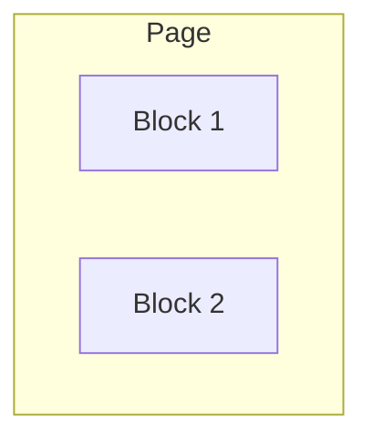

# Tailwind CSS — UI-02 Layout Mastery

## Let's learn each item practically and step-by-step.

### 1. CSS Box Model

Every element has:

```Text
* Margin
* Border
* Padding
* Context
```

In Tailwind CSS:

```jsx
<div className="m-4 border-2 p-6">
  Hello
</div>
```

* m-4 → margin
* border-2 → border
* p-6 → padding
* Content → actual content

### 2. Block

A block element takes the available width and starts on a new line.

```
<div className="block bg-blue-500 p-4">
  Block 1
</div>

<div className="block bg-red-500 p-4">
  Block 2
</div>
```




### 3. Inline
inline keeps elements on the same line.

```
<span className="inline bg-blue-500">
  Hello
</span>

<span className="inline bg-red-500">
  World
</span>
```

```Remember```: inline elements don't behave like normal block boxes for width/height.


### 4. inline-block

inline-block gives you both:

* inline positioning
* ability to control width/height

```
<span className="inline-block w-32 bg-blue-500 p-4">
  Box 1
</span>

<span className="inline-block w-32 bg-red-500 p-4">
  Box 2
</span>
```

Useful for:

* badges
* buttons
* small UI elements

|Feature|Inline|block|inline-block|
|:-------|------|-----|------------|
|**Starts on new line?**|No, stays on the same line.|**Yes**, forces a line break.|No, stays on the same line.|
|**Fills available width?**|No, only takes up the space of its content.|Yes, stretches to fill the container's width.|No, only takes up the space of its content by default.|
|**Respects width & height?**|No, these properties are ignored.|**Yes.**|**Yes.**|
|**Respects top/bottom margin & padding?**|No, it will not push surrounding vertical content away.|**Yes.**|**Yes.**|


# Flex and their use

## 5. flex

flex creates a Flexbox container.

```
<div className="flex">
  <div>One</div>
  <div>Two</div>
  <div>Three</div>
</div>
```

Default direction:

One  → Two  →  Three

This is one of the most important Tailwind utilities.

--- 

## 6. flex-row

Places children horizontally.

```
<div className="flex flex-row">
  <div>One</div>
  <div>Two</div>
  <div>Three</div>
</div>
```

One → Two → Three

flex-row is the default flex direction.

---

## 7. flex-col

Places children vertically.

```
<div className="flex flex-col">
  <div>One</div>
  <div>Two</div>
  <div>Three</div>
</div>
```

One
↓
Two
↓
Three

Very useful for mobile layouts and vertical forms.

--- 

## 8. flex-wrap

Without wrapping, flex items try to stay on one line.

```
<div className="flex flex-wrap gap-4">
  <div className="w-40">1</div>
  <div className="w-40">2</div>
  <div className="w-40">3</div>
  <div className="w-40">4</div>
</div>
```

When there isn't enough room, items move to the next line.

```
1    2    3
4
```

--- 

## 9. justify-*

justify-* controls the main axis.

Common values:

* justify-start
* justify-center
* justify-end
* justify-between
* justify-around
* justify-evenly

Example:

```
<div className="flex justify-between">
  <span>Logo</span>
  <span>Login</span>
</div>
```

Result:

```
Logo                         Login
```

Remember

With ```flex-row```:

```
justify → horizontal
```


## 10. items-*

items-* controls the cross axis.

Common values:

```
items-start
items-center
items-end
items-stretch
```

Example:

```
<div className="flex h-24 items-center">
  <p>Hello</p>
</div>
```

The text becomes vertically centered.

The most common combination you'll see is:

```
<div className="flex items-center justify-between">
```

## 11. content-*

content-* controls the alignment of multiple flex lines when flex-wrap is being used.

```
<div className="flex flex-wrap content-center h-96">
  ...
</div>
```

Common:
* content-start
* content-center
* content-end
* content-between
* content-around
* content-evenly

### Important difference

```
items-*   → alignment of flex items
content-* → alignment of flex lines
```

You will use items-* much more often.

## 12. gap-*
gap-* adds spacing between children.

```<div className="flex gap-4">
  <div>One</div>
  <div>Two</div>
  <div>Three</div>
</div>
```

```
One    Two    Three
```

You can use:
```
gap-2
gap-4
gap-6
gap-8
```

It also works with Grid:

```
<div className="grid grid-cols-3 gap-6">
```

---

## 13. space-x-*

Adds horizontal spacing between children.
```
<div className="flex space-x-4">
  <div>One</div>
  <div>Two</div>
  <div>Three</div>
</div>
```
Think:
```
One → space → Two → space → Three
```

--- 

## 14. space-y-*

Adds vertical spacing between children.

```
<div className="space-y-4">
  <p>First</p>
  <p>Second</p>
  <p>Third</p>
</div>
```

Result:

```
First

Second

Third
```

### gap vs space

**For new layouts, gap-** is usually easier:*

```
<div className="flex flex-col gap-4">
```

--- 

## 15. Grid

grid creates a CSS Grid container.

```
<div className="grid">
  <div>1</div>
  <div>2</div>
  <div>3</div>
</div>
```

Usually you'll combine it with columns:

```<div className="grid grid-cols-3">
```

---

## 16. Define Grid Columns

Use grid-cols-*.

2 columns

```
<div className="grid grid-cols-2 gap-4">
  <div>1</div>
  <div>2</div>
  <div>3</div>
  <div>4</div>
</div>
```

|1|2|
|-|-|
|3|4|


### 3 columns

```
<div className="grid grid-cols-3 gap-4">
```

### 4 columns

```
<div className="grid grid-cols-4 gap-4">
```

## 17. Define Grid Rows

Use:

grid-rows-*

Example:

```
<div className="grid grid-cols-3 grid-rows-2 gap-4">
```

This creates:

3 columns
×
2 rows

|1|2|3|
|-|-|-|
|4|5|6|

--- 

## 18. col-span-*

Allows an item to occupy multiple columns.

```
<div className="grid grid-cols-4 gap-4">
```

```
  <div className="col-span-2">
    Wide Box
  </div>

  <div>Box</div>

  <div>Box</div>

</div>
```

---

col-span-2 means:

``` This element occupies 2 columns. ```

You can also use:

```
col-span-1
col-span-2
col-span-3
col-span-4
```

# Responsive Design

## 19. Responsive Grids

This is extremely important for real-world websites.

```
<div className="grid grid-cols-1 gap-6 md:grid-cols-2 lg:grid-cols-4">
```

Meaning:

```
Mobile       → 1 column
md           → 2 columns
lg           → 4 columns
```

Visual:

### Mobile

|Card 1 |
|---|
|Card 2 |
|Card 3 |

### Desktop

|1|2|3|4
|---|---|---|---|

### This is Tailwind's mobile-first responsive approach.
--- 


End Lecture UI-02
