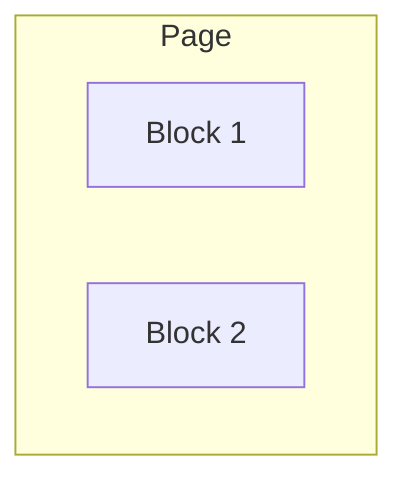

# Tailwind CSS — UI-02 Layout Mastery

## Let's learn each item practically and step-by-step.

### 1. CSS Box Model

Every element has:

```Text
* Margin
* Border
* Padding
* Context
```

In Tailwind CSS:

```jsx
<div className="m-4 border-2 p-6">
  Hello
</div>
```

* m-4 → margin
* border-2 → border
* p-6 → padding
* Content → actual content

### 2. Block

A block element takes the available width and starts on a new line.

```
<div className="block bg-blue-500 p-4">
  Block 1
</div>

<div className="block bg-red-500 p-4">
  Block 2
</div>
```




### 3. Inline
inline keeps elements on the same line.

```
<span className="inline bg-blue-500">
  Hello
</span>

<span className="inline bg-red-500">
  World
</span>
```

```Remember```: inline elements don't behave like normal block boxes for width/height.


### 4. inline-block

inline-block gives you both:

* inline positioning
* ability to control width/height

```
<span className="inline-block w-32 bg-blue-500 p-4">
  Box 1
</span>

<span className="inline-block w-32 bg-red-500 p-4">
  Box 2
</span>
```

Useful for:

* badges
* buttons
* small UI elements

|Feature|Inline|block|inline-block|
|:-------|------|-----|------------|
|**Starts on new line?**|No, stays on the same line.|**Yes**, forces a line break.|No, stays on the same line.|
|**Fills available width?**|No, only takes up the space of its content.|Yes, stretches to fill the container's width.|No, only takes up the space of its content by default.|
|**Respects width & height?**|No, these properties are ignored.|**Yes.**|**Yes.**|
|**Respects top/bottom margin & padding?**|No, it will not push surrounding vertical content away.|**Yes.**|**Yes.**|


# Flex and their use

## 5. flex

flex creates a Flexbox container.

```
<div className="flex">
  <div>One</div>
  <div>Two</div>
  <div>Three</div>
</div>
```

Default direction:

One  → Two  →  Three

This is one of the most important Tailwind utilities.

--- 

## 6. flex-row

Places children horizontally.

```
<div className="flex flex-row">
  <div>One</div>
  <div>Two</div>
  <div>Three</div>
</div>
```

One → Two → Three

flex-row is the default flex direction.

---

## 7. flex-col

Places children vertically.

```
<div className="flex flex-col">
  <div>One</div>
  <div>Two</div>
  <div>Three</div>
</div>
```

One
↓
Two
↓
Three

Very useful for mobile layouts and vertical forms.

--- 

## 8. flex-wrap

Without wrapping, flex items try to stay on one line.

```
<div className="flex flex-wrap gap-4">
  <div className="w-40">1</div>
  <div className="w-40">2</div>
  <div className="w-40">3</div>
  <div className="w-40">4</div>
</div>
```

When there isn't enough room, items move to the next line.

```
1    2    3
4
```

--- 

## 9. justify-*

justify-* controls the main axis.

Common values:

* justify-start
* justify-center
* justify-end
* justify-between
* justify-around
* justify-evenly

Example:

```
<div className="flex justify-between">
  <span>Logo</span>
  <span>Login</span>
</div>
```

Result:

```
Logo                         Login
```

Remember

With ```flex-row```:

```
justify → horizontal
```


End Lecture UI-02
