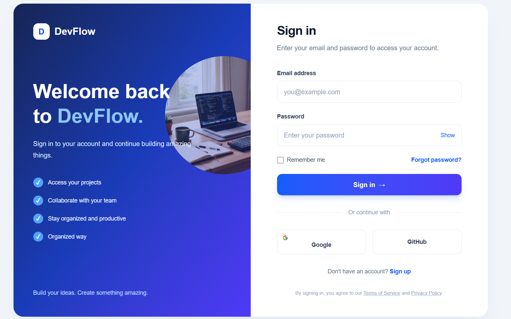

# 3. Login Page

```
## components/LoginForm.tsx
## components/LoginPage.tsx
## components/WelcomePanel.tsx
```

# components/LoginForm.tsx

```code
"use client";

import { FcGoogle } from "react-icons/fc";


import { useState, type FormEvent } from "react";

export default function LoginForm() {
    const [showPassword, setShowPassword] = useState(false);
    const [email, setEmail] = useState("");
    const [password, setPassword] = useState("");

    function handleSubmit(event: FormEvent<HTMLFormElement>) {
        event.preventDefault();

        // Connect your authentication API here.
        console.log({ email, password });
    }

    return (
        <div className="w-full max-w-md">
            <div className="mb-10">
                <h2 className="text-3xl font-bold tracking-tight text-slate-900">
                    Sign in
                </h2>

                <p className="mt-3 leading-6 text-slate-500">
                    Enter your email and password to access your account.
                </p>
            </div>

            <form onSubmit={handleSubmit} className="space-y-6">
                {/* Email */}
                <div>
                    <label
                        htmlFor="email"
                        className="mb-2 block text-sm font-semibold text-slate-700"
                    >
                        Email address
                    </label>

                    <input
                        id="email"
                        type="email"
                        autoComplete="email"
                        placeholder="you@example.com"
                        value={email}
                        onChange={(event) => setEmail(event.target.value)}
                        required
                        className="w-full rounded-xl border border-slate-200 bg-white px-4 py-3.5 text-slate-900 outline-none transition placeholder:text-slate-400 focus:border-blue-500 focus:ring-4 focus:ring-blue-500/10"
                    />
                </div>

                {/* Password */}
                <div>
                    <label
                        htmlFor="password"
                        className="mb-2 block text-sm font-semibold text-slate-700"
                    >
                        Password
                    </label>

                    <div className="relative">
                        <input
                            id="password"
                            type={showPassword ? "text" : "password"}
                            autoComplete="current-password"
                            placeholder="Enter your password"
                            value={password}
                            onChange={(event) => setPassword(event.target.value)}
                            required
                            className="w-full rounded-xl border border-slate-200 bg-white px-4 py-3.5 pr-20 text-slate-900 outline-none transition placeholder:text-slate-400 focus:border-blue-500 focus:ring-4 focus:ring-blue-500/10"
                        />

                        <button
                            type="button"
                            onClick={() => setShowPassword(!showPassword)}
                            aria-label={showPassword ? "Hide password" : "Show password"}
                            className="absolute right-4 top-1/2 -translate-y-1/2 text-sm font-medium text-blue-600 hover:text-blue-800"
                        >
                            {showPassword ? "Hide" : "Show"}
                        </button>
                    </div>
                </div>

                {/* Remember and Forgot */}
                <div className="flex items-center justify-between gap-3 text-sm">
                    <label className="flex items-center gap-2 text-slate-600">
                        <input
                            type="checkbox"
                            className="h-4 w-4 rounded border-slate-300 accent-blue-600"
                        />
                        Remember me
                    </label>

                    <a
                        href="/forgot-password"
                        className="font-semibold text-blue-600 hover:text-blue-800"
                    >
                        Forgot password?
                    </a>
                </div>

                {/* Submit */}
                <button
                    type="submit"
                    className="flex w-full items-center justify-center gap-2 rounded-xl bg-linear-to-r from-blue-600 to-indigo-600 px-4 py-3.5 font-semibold text-white shadow-lg shadow-blue-600/20 transition hover:-translate-y-0.5 hover:shadow-xl focus:outline-none focus:ring-4 focus:ring-blue-500/30"
                >
                    Sign in
                    <span aria-hidden="true">→</span>
                </button>
            </form>

            {/* Divider */}
            <div className="my-8 flex items-center gap-4">
                <div className="h-px flex-1 bg-slate-200" />
                <span className="text-sm text-slate-400">Or continue with</span>
                <div className="h-px flex-1 bg-slate-200" />
            </div>

            {/* Social buttons */}
            <div className="grid grid-cols-2 gap-4">
                <button
                    type="button"
                    className="rounded-xl border border-slate-200 px-3 py-3 text-sm font-semibold text-slate-700 transition hover:bg-slate-50"
                >
                    <FcGoogle /> Google
                </button>

                <button
                    type="button"
                    className="rounded-xl border border-slate-200 px-3 py-3 text-sm font-semibold text-slate-700 transition hover:bg-slate-50"
                >
                    GitHub
                </button>
            </div>

            <p className="mt-8 text-center text-sm text-slate-500">
                Don't have an account?{" "}
                <a
                    href="/register"
                    className="font-semibold text-blue-600 hover:text-blue-800"
                >
                    Sign up
                </a>
            </p>

            <p className="mt-8 text-center text-xs leading-5 text-slate-400">
                By signing in, you agree to our{" "}
                <a href="/terms" className="underline hover:text-blue-600">
                    Terms of Service
                </a>{" "}
                and{" "}
                <a href="/privacy" className="underline hover:text-blue-600">
                    Privacy Policy
                </a>
                .
            </p>
        </div>
    );
}
```

---

# components/LoginPage.tsx

```code
import LoginForm from "./LoginForm";
import WelcomePanel from "./WelcomePanel";

export default function LoginPage() {
    return (
        <main className="flex min-h-screen items-center justify-center bg-slate-100 p-4 sm:p-8">
            <div className="grid w-full max-w-6xl overflow-hidden rounded-3xl bg-white shadow-2xl shadow-slate-300/40 md:min-h-7xl md:grid-cols-2">
                <WelcomePanel />

                <section className="flex items-center justify-center px-6 py-12 sm:px-12 lg:px-16">
                    <LoginForm />
                </section>
            </div>
        </main>
    );
}
```

---

# components/WelcomePanel.tsx

```public/img/img_table.png (for reference)```

```code
export default function WelcomePanel() {
  return (
    <section className="relative hidden overflow-hidden bg-linear-to-br from-blue-950 via-blue-800 to-indigo-600 p-12 text-white md:flex md:flex-col md:justify-between">
      
      <div className="absolute -right-20 top-32 h-72 w-72 rounded-full opacity-70 bg-[url('**/img/img_table.jpg**')] bg-cover bg-center bg-no-repeat " />

      <div className="relative">
        <div className="flex items-center gap-3">
          <div className="flex h-10 w-10 items-center justify-center rounded-xl bg-white text-xl font-bold text-blue-700">
            D
          </div>

          <span className="text-2xl font-bold">DevFlow</span>
        </div>

        <div className="mt-24">
          <h1 className="text-4xl font-bold leading-tight lg:text-5xl">
            Welcome back
            <br />
            to <span className="text-blue-300">DevFlow.</span>
          </h1>

          <p className="mt-6 max-w-sm leading-7 text-blue-100">
            Sign in to your account and continue building amazing things.
          </p>
        </div>

        <div className="mt-10 space-y-5">
          {[
            "Access your projects",
            "Collaborate with your team",
            "Stay organized and productive",
            "Organized way"
          ].map((item) => (
            <div key={item} className="flex items-center gap-3">
              <span className="flex h-6 w-6 items-center justify-center rounded-full bg-blue-400 text-sm font-bold">
                ✓
              </span>

              <span className="text-sm text-blue-50">{item}</span>
            </div>
          ))}
        </div>
      </div>

      <p className="relative mt-16 text-sm text-blue-200">
        Build your ideas. Create something amazing.
      </p>
    </section>
  );
}
```

---

# ## page.tsx (in main)

```code
import LoginPage from "./components/LoginPage";

export default function Home() {
  return (
    
    <LoginPage/>
  );
}
```

---




